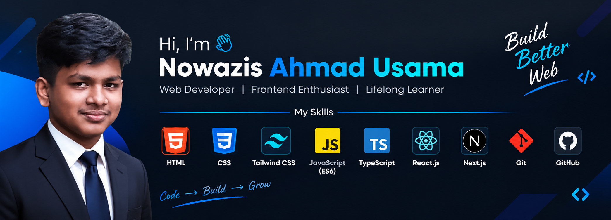

  

<h1 align="center">Hi 👋, I'm Nowazis Ahmad Usama</h1>
<h3 align="center">A passionate frontend developer from Bangladesh</h3>

- 🔭 I’m currently working on [Fit-Log](https://github.com/nowazisahmad/Fit-Log)

- 🌱 I’m currently learning **Next JS**

- 💬 Ask me about **react, next js**

- 📫 How to reach me **1289usama@gmail.com**

<h3 align="left">Connect with me:</h3>

<h3 align="left">Languages and Tools:</h3>

        

